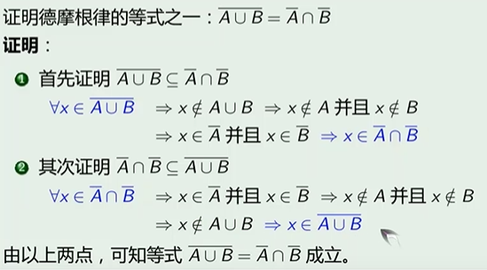

{\rtf1}

## 集合

集合中的元素可以是任何对象

### 集合表示

1. 枚举法
2. 叙述法：具有某种性质的元素
3. 文氏图

### 集合基数

1. 集合A中的元素的个数是|A|；
2. 若一个集合的基数是有限的，则该集合为有限集
3. 若一个集合的基数是无限的，则称该集合为无限集

$$A = {a,b,c},|A| = 3$$

$$B = {a,{b,c}},|B| = 2$$

### 空集

空集是唯一的

$|\emptyset| = 0,|{\emptyset}| = 1$

### 全集

全集在文氏图中一般用方形表示；

### 元素的基本特性

1. 集合中的元素是无序的，${1,2,3,4}$与${2,3,1,4}$相同
2. 集合中的元素是不同的，${1,2,2,3,4,3,4,2}$与${1,2,3,4}$相同

**外延性原理**

两个集合$A,B$相等，当且仅当他们的元素完全相同，记$A=B$，否则$A$和$B$不相同，记作$A\neq B$；

**定理**

设$A,B$为任意两个集合，则$A=B\iff A\subseteq B,B\subseteq A$

证明两个集合相等，证明$A\subseteq B$同时$B\subseteq A$

**幂集**

$A$为任意集合，把A的所有不同子集构成的集合叫做A的幂集，记作$P(A)$

比如$A = {a,{b,c}}$，$P(A)={\emptyset, {a}, {b,c},{a,{b,c}}}$

### 集合的运算 

1. 并集
2. 交集
3. 补集，设$U$是全集，则集合$A$的补集定义为：$\overline A = {x|x\notin A}$
4. 差集
ew
5. 对称差，$A$与$B$的对称差就是只属于$A$的和只属于$B$的元素的并

**运算定律**

1. 幂等律：$A\cup A \cup ... A= A,A\cap A \cap ... A= A$
2. 同一律：$A\cup \emptyset = A ,A\cap U = A$
3. 零律： $A\cup U = U, A\cap \emptyset = \emptyset$
4. 德摩根律，交换律，结合律，分配律

### 不可数集合与可数集合

如何比较集合的大小，对于两个有限集合，只需要比较集合的基数；

**等势**

如果两个集合的所有元素具有一种相互的一一映射关系，那么两个集合是等势的；

**可数集合**

凡是与自然数集合$\text{N}$等势的集合，成为可数集合（countable set）

正奇数集合、素数集合、有理数集合都是可数集合

正奇数集合、素数集合是自然数集合的子集，然而它们是与自然数集合是等势的，而有理数集合元素比自然数集合多得多，它们仍然是等势的；

因此我们可以意识到，两个无限集合的“大小”已经不能单纯使用集合中的元素个数来衡量。$aleph_0$表示一切可数集合的基数，是一种抽象的表达；

**不可数集合**

开区间$(0,1)$称不可数集合，凡是与$(0,1)$等势的集合成为不可数集合，该类集合的基数为$\aleph$

实数集合是不可数集合